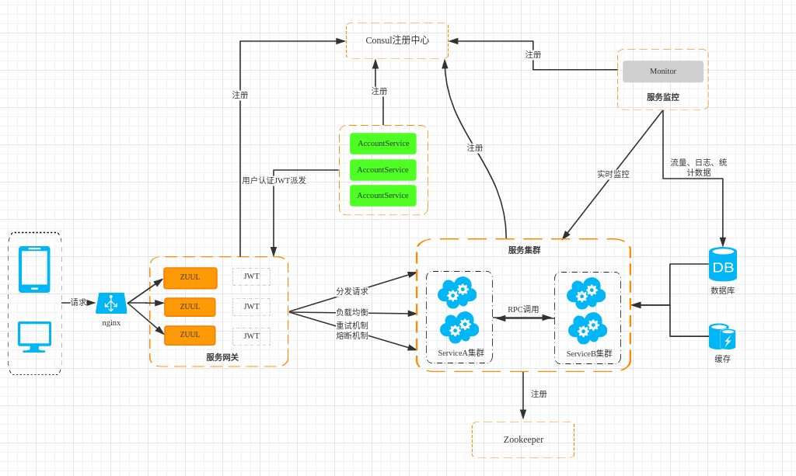

# 应用&插件&框架
## 应用&架构
TIC微服务架构V2.0

- 使用唯一单点的 Nginx 来做服务器的反向代理，接收用户的所有请求  
- 请求经过网关（Gateway）路由转发给服务，在 gateway 上做鉴权、负载均衡等。  
- 服务（Service）间通过rpc进行调用  
- 监控器（Monitor）监控每个Service的状态，由Service推送至Monitor，最后由Monitor对处理后的流量、日志、统计数据入库
## web框架
- 框架：[egg](https://github.com/eggjs/egg)
- 版本：2.x
- node版本：10.x

### 环境和配置
本地开发环境配置在 `config.local.js` 中，并在 .igonre 中声明忽略此文件提交，测试服务器采用测试环境启动，正式服务器采用生产环境启动，也就是说除了默认的配置文件，项目仓库只可以有其他的两个配置文件，测试和生产环境配置
## 常用插件
- [egg-rpc4js](https://github.com/iamljw/egg-rpc4js)： 多服务调用
- [egg-response](https://github.com/iamljw/egg-response)： 快捷数据响应
- [egg-error-handler](https://github.com/iamljw/egg-error-handler)： (请求的)错误捕获处理
- [egg-consul-plus](https://github.com/iamljw/egg-consul-plus)： consul客户端
- [egg-validate](https://github.com/eggjs/egg-validate)： 参数校验
- [egg-router-plus](https://github.com/eggjs/egg-router-plus)： 路由
- [egg-cors](https://github.com/eggjs/egg-cors)： 跨域插件
